# gaming-store-web-app
This is the final project for the Introduction to Software Engineering course.
<i class="fa-brands fa-trello"></i> [](https://trello.com/b/jES6YGRt/c%C3%B4ng-ngh%E1%BB%87-ph%E1%BA%A7n-m%E1%BB%81m)

Run project by: 
```
cd \backend
npm run dev
```

Using mysql database:
```
mysql -u root -p
```

Server run on port 8080 (http://localhost:8080), client run on port 8081 (http://localhost:8081)


## Landing page
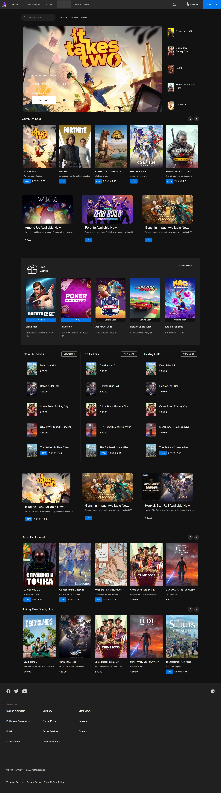

## Distribution page
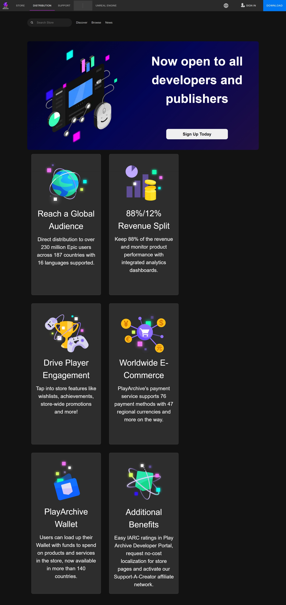

## Login page
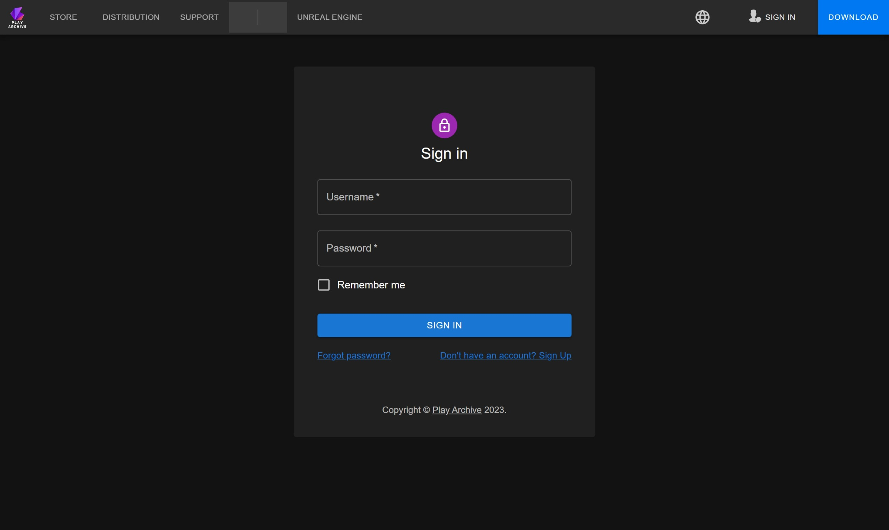

## Register page
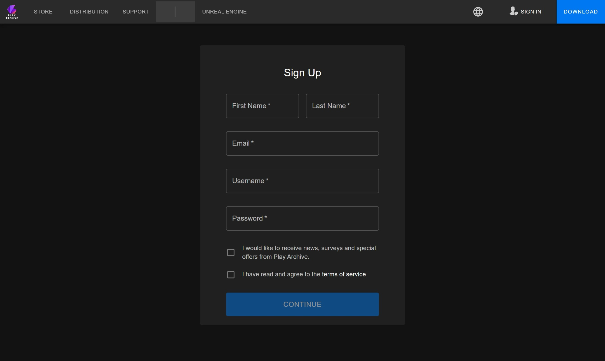

## Browse page
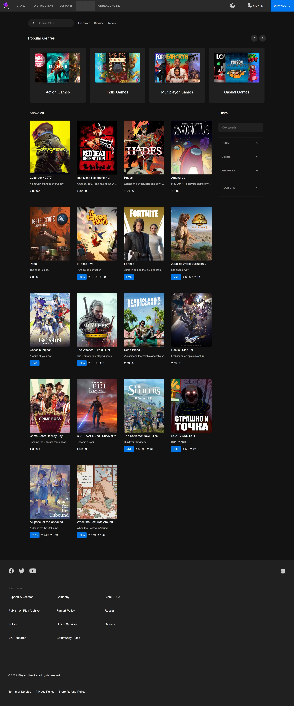

## Game page
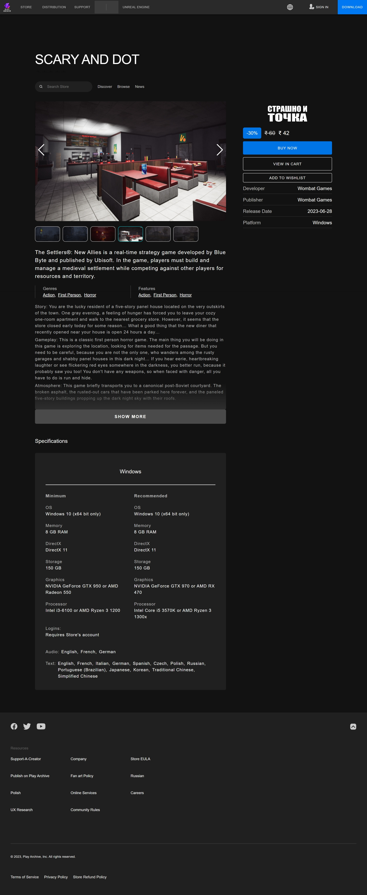

## Wishlist page
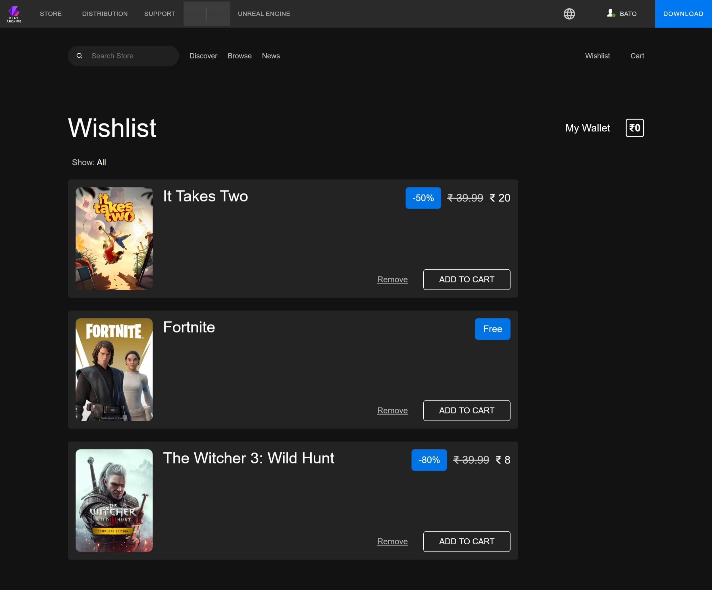

## Cart page
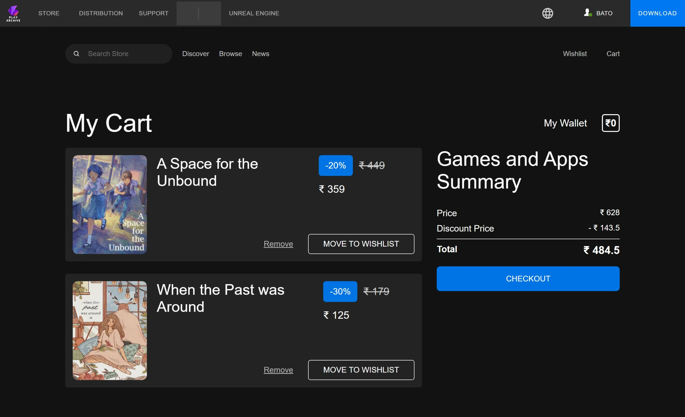

## Checkout page
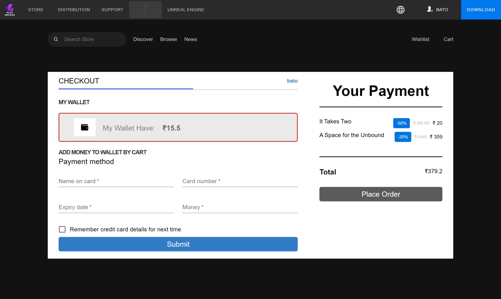

## Order history page
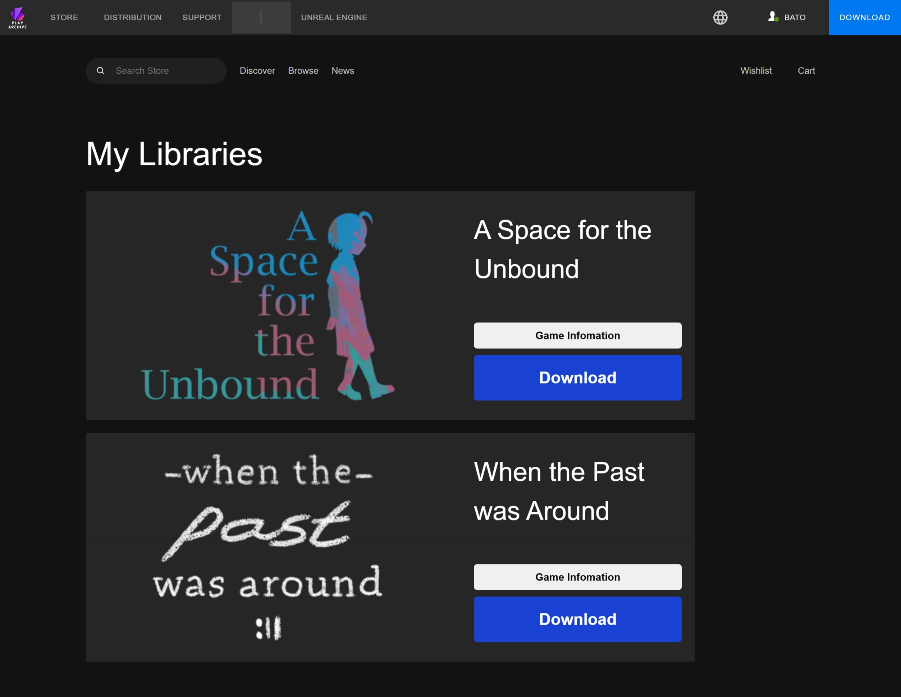

## Profile page
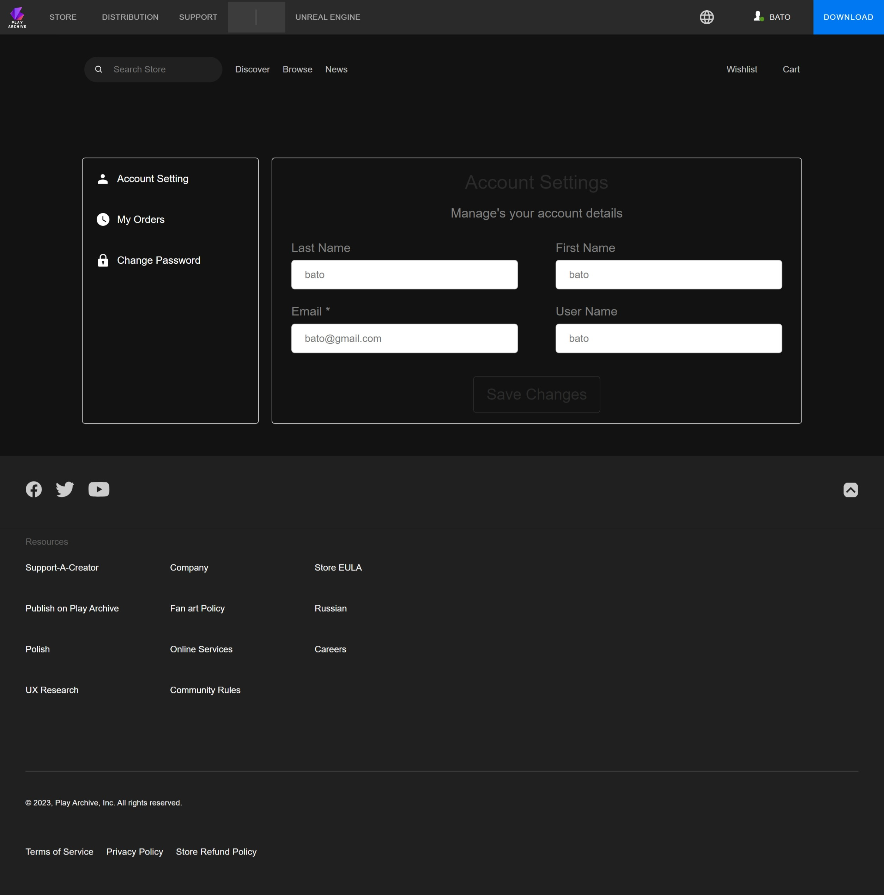
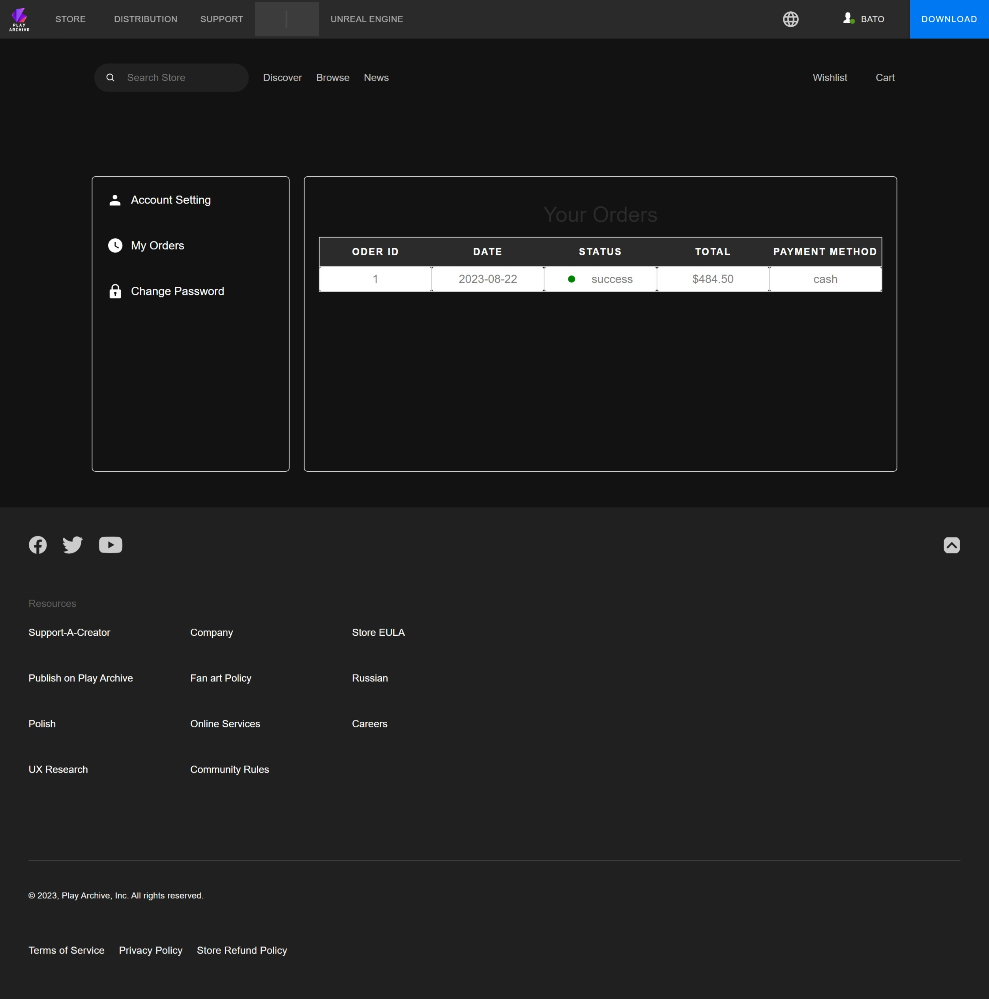


